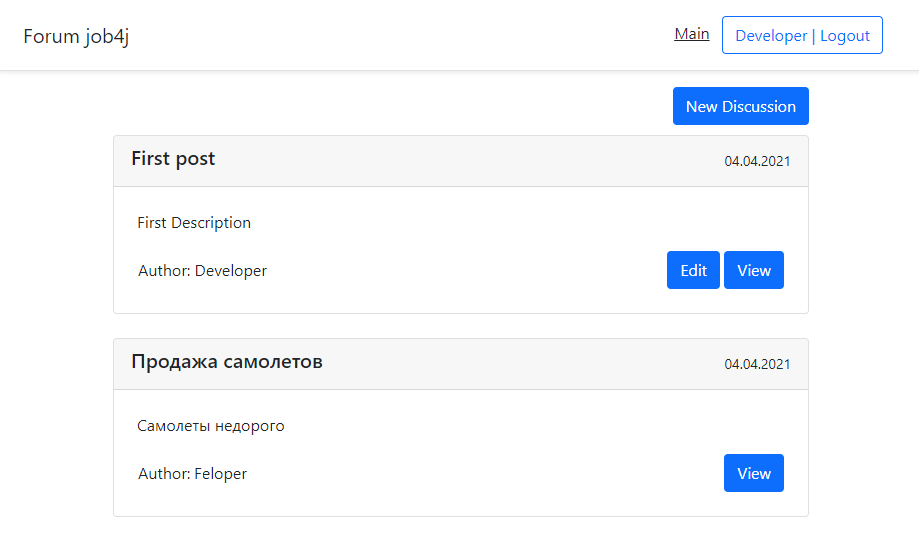
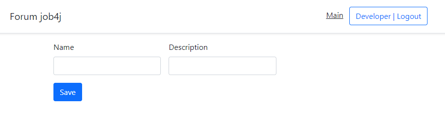
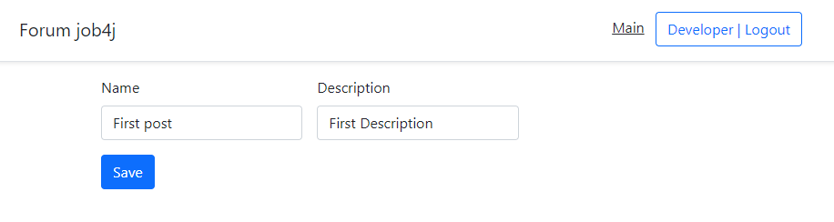
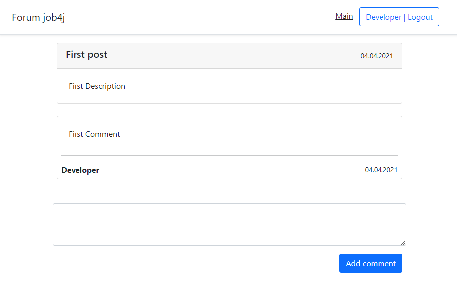
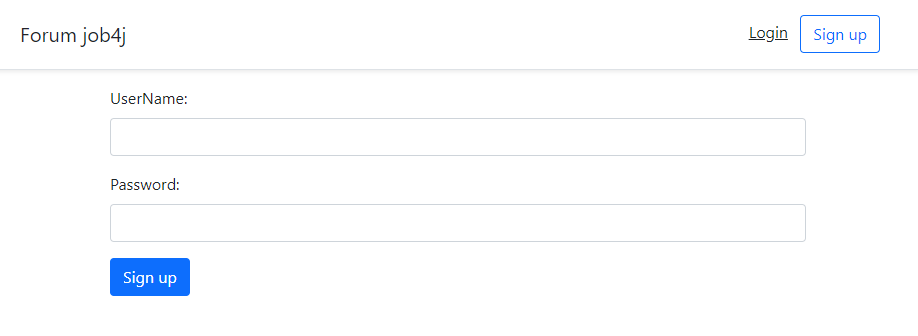
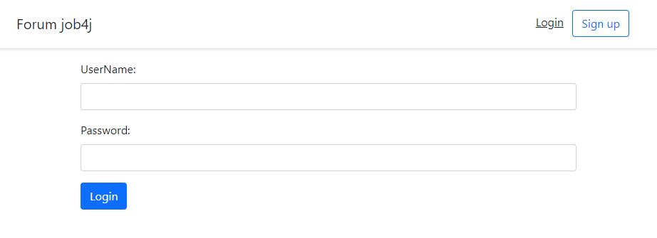

# job4j_forum

 Классическое приложение форум, с использованием Spring Boot.

 Проект размещён на облачной PaaS-платформе [Heroku](https://frozen-mountain-05627.herokuapp.com).

 Краткое описание проекта:
- С помощью Spring Boot Security реализована регистрация и авторизация пользователей
- Пользователи могу создавать посты, и изменять только свои посты
- Пользователи могут просматривать посты и оставлять там комментарии
- Запросы к БД осуществлялись используя Spring Boot Data
- Данные хранятся в PostgreSQL, для тестов использовалась H2
- С помощью Liquibase происходило управление схемой БД
- Для тестирования использовался Spring Boot Test
- Использовался шаблон MVC

В данном проекте использовались:
- Java 11
- Spring Boot: Web, Security, Data, Test, Devtools
- JSP, JSTL, Bootstrap
- JaCoCo, Checkstyle
- PostgreSQL, H2, Liquibase
- Logback
- Apache Commons DBCP
- Lombok

Главная страница. На ней находятся все посты. Пользователи могут добавлять новые посты, просматривать существующие. Редактировать пост может только автор поста.

Добавить новый пост.

Изменить существующий пост. Доступна страница только автору данного поста.

Страница поста с комментариями. Комментарии могут добавлять все авторизованные пользователи.

Регистрация.

Вход пользователя в свой аккаунт.
